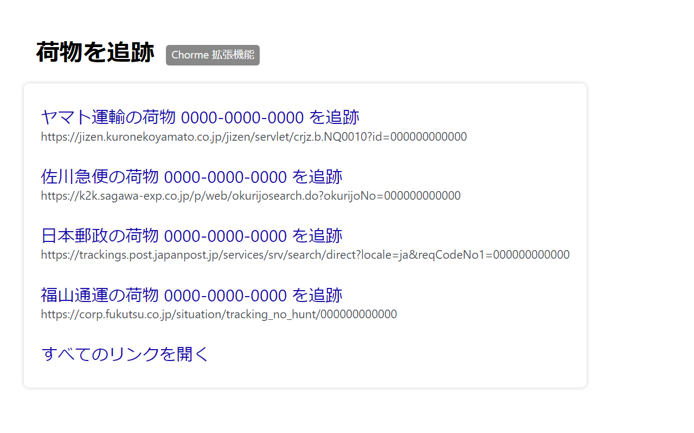

# 荷物を追跡（Chrome拡張機能）

## 概要
荷物追跡用のリンクを作成します。失われたGoogle検索の便利機能を再現するものです。

選択中のテキスト（追跡番号）をもとに、荷物追跡ページ（ヤマト運輸、佐川急便、日本郵便、福山通運）へのリンクを作成します。  
2023年7月頃まではGoogle検索で同様の機能が提供されていましたが、仕様変更または一時的な不具合によりこれが利用できなくなったため、急遽この拡張機能を作成しました。  
特別な権限を必要とせず、個人情報などいっさい収集しないシンプルな拡張機能です。  
これまでGoogle検索で荷物を追跡していた人には便利にお使いいただけると思います。  

## 対応ブラウザ
以下のウェブブラウザ（いずれもWindows版）での動作を確認しています。
* Chrome
* Brave
* Edge

## インストール
[chrome ウェブストア](https://chrome.google.com/webstore/detail/oenibinhbdeecoknjbonjdkaoakagodk){:target="_blank"} からインストールしてください。

## 使い方
1. 閲覧中の画面上で荷物の追跡番号を選択して右クリック
1. コンテキストメニューの『荷物番号「0000000000」を追跡』をクリック
1. 新しいタブに荷物追跡ページへのリンクが表示されます。

## プライバシーポリシー
この拡張機能はブラウザ上でユーザーによって選択されたテキストのみを読み取って動作します。  
それ以外の、例えばユーザーが閲覧しているページのアドレスや内容、ユーザーが入力したテキスト、その他のブラウザに保存されたデータを読み取ることはありません。  
また、この拡張機能が何らかのデータをブラウザ内に保存したり、外部と通信を行うことはありません。

## ライセンス
[MIT License](https://choosealicense.com/licenses/mit/)

## 更新履歴
* 0.2.4（2023/08/13）  
    - 「すべてのリンクを開く」をキャンセルした場合に新しいタブが開いてしまう問題を修正
* 0.2.3（2023/08/06）  
    - 不必要な権限が要求されていた問題を修正